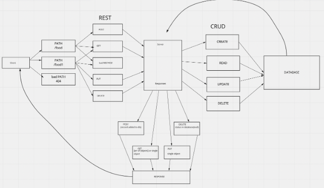

# basic-api-server LAB 03

- SQL Models-Create 2 SQL data models using the Sequelize libary, make sure you export those model instances.
Make sure your Models are configured with your SQL dialect and can properly connect to your database.
Your models should have appropriate field names declared with specific sequelize DataTypes

- Routes-In your express server, create a route module for each data model that you’ve created. Within the router module, create REST route handlers for each of the REST Methods that properly calls the correct CRUD method from the matching data model.

## Links

- [Heroku](https://sm-basic-api-server.herokuapp.com/)

- [Repo](https://github.com/SdMartinez13/basic-api-server)

## UML

